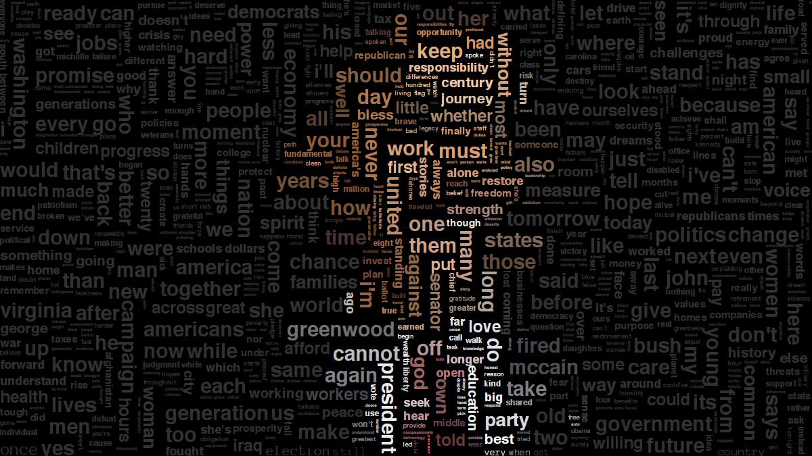
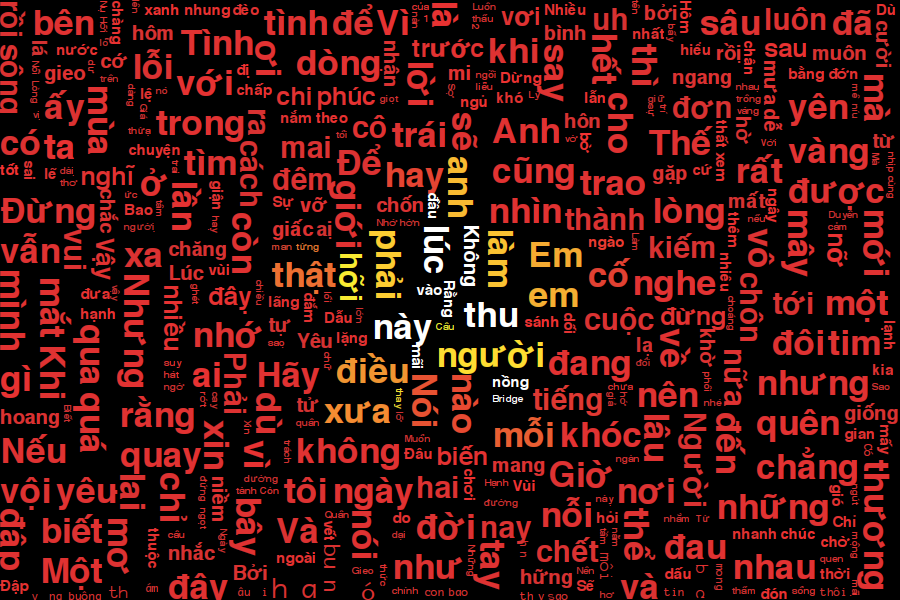
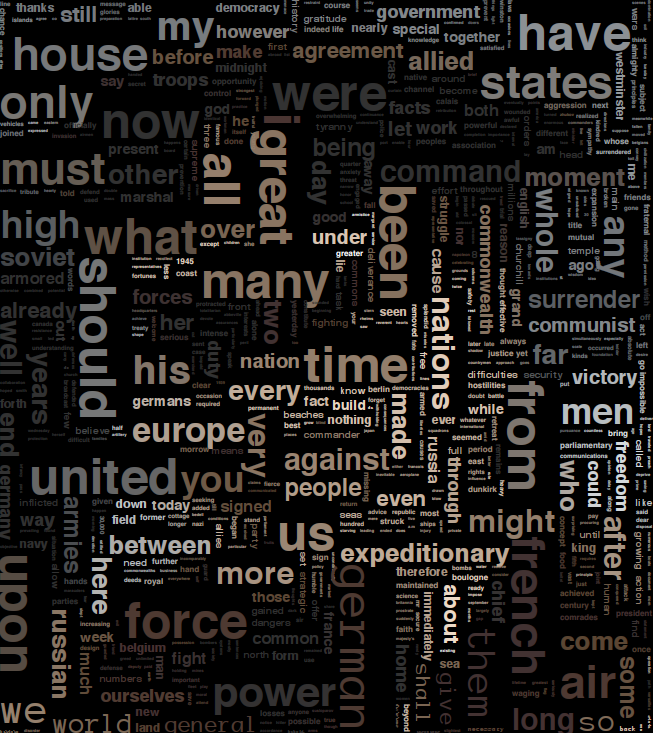

##  R-Tree Cloud

### Screenshots

<table>
    <tr>
        <td></td>
        <td></td>
        <td></td>
        <td></td>
    </tr>
</table>

### Motivation

### Algorithms

### References
- [Immutable in-memory R-tree and R*-tree implementations in Java with reactive api](https://github.com/davidmoten/rtree)
- [Algorithm to implement a word cloud like Wordle](https://stackoverflow.com/questions/342687/algorithm-to-implement-a-word-cloud-like-wordle)
- [Kumo](https://github.com/kennycason/kumo)
- [Pretty Word Cloud](https://github.com/prettywordcloud/prettywordcloud.github.io)
- [Beautiful Visualization](https://www.oreilly.com/library/view/beautiful-visualization/9781449379889/)